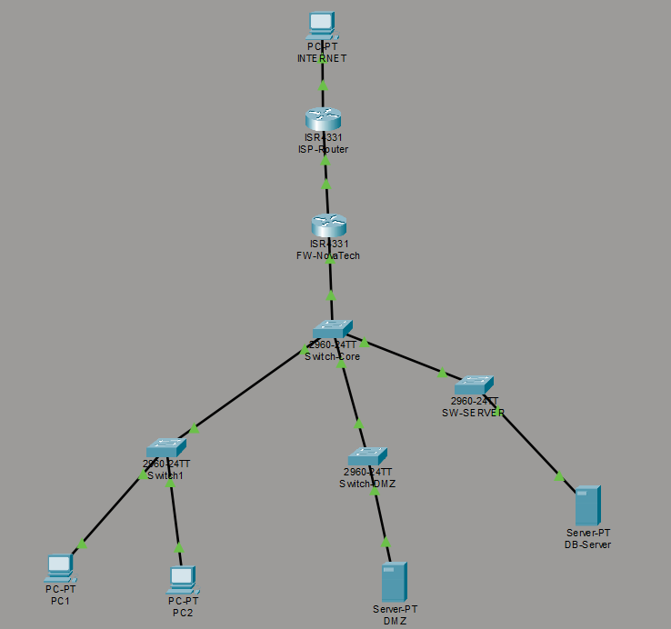
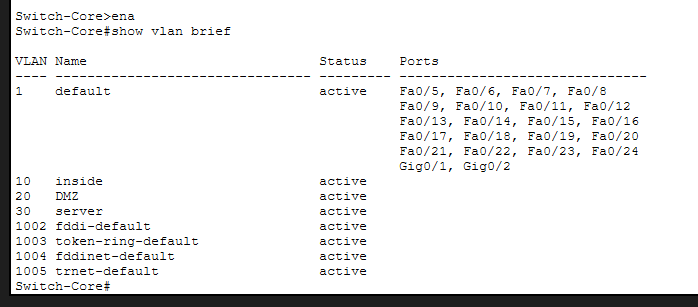
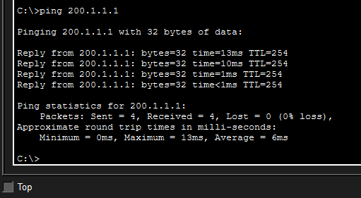
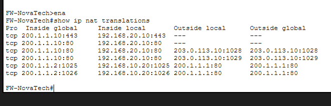
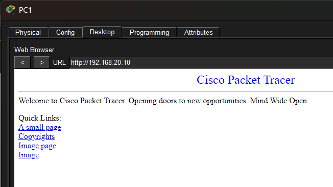
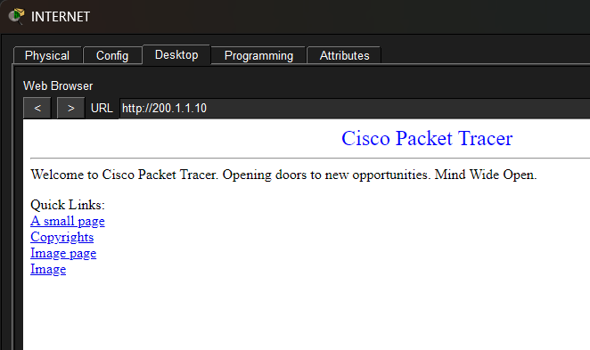
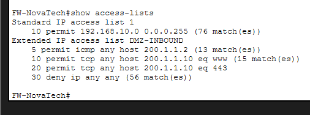

# 06 - Enterprise DMZ & Firewall Lab

Simulación de arquitectura empresarial con seguridad perimetral, segmentación de red, DMZ pública y publicación segura de servicios mediante NAT.
Implementada en Cisco Packet Tracer. 

## Escenario
Empresa NovaTech Corporation con tres zonas principales:

- **VLAN 10 - Inside** → Red interna de usuarios con acceso a Internet mediante NAT/PAT
- **VLAN 20 - DMZ** → Zona aislada para servicios públicos accesibles desde Internet
- **VLAN 30 - Servers** → Red interna destinada a servidores corporativos

## Topología


## Direccionamiento
| Zona | Red | Gateway | VLAN |
|---|---|---|---|
| Inside Users | 192.168.10.0/24 | 192.168.10.1 | VLAN 10 |
| DMZ Web Server | 192.168.20.0/24 | 192.168.20.1 | VLAN 20 |
| Internal Servers | 192.168.30.0/24 | 192.168.30.1 | VLAN 30 |
| Firewall WAN | 200.1.1.0/24 | 200.1.1.2 | — |
| ISP Network | 203.0.113.0/24 | 203.0.113.1 | — |

## Tecnologías implementadas
- VLANs y Trunks 802.1Q
- Router-on-a-Stick con subinterfaces
- Firewall perimetral Cisco
- ACL extendidas
- NAT dinámico con PAT
- NAT estático para publicación de servicios
- DMZ empresarial
- Default Route hacia ISP

## Arquitectura de seguridad
```
        INTERNET
            |
        ISP Router
            |
        FW-NovaTech
            |
    ----------------------
    |          |          |
 VLAN 10    VLAN 20    VLAN 30
 Inside      DMZ       Servers
```

## Reglas de seguridad
| Regla | Origen | Destino | Resultado |
|---|---|---|---|
| 1 | VLAN 10 | Internet | ✅ Permitido |
| 2 | VLAN 10 | DMZ Web Server | ✅ Permitido |
| 3 | Internet | Web Server DMZ | ✅ Permitido (HTTP/HTTPS) |
| 4 | Internet | VLAN 10 | ❌ Denegado |
| 5 | Internet | VLAN 30 | ❌ Denegado |
| 6 | Servicios no publicados | DMZ | ❌ Denegado |

## Servicios publicados
| Servicio | IP Privada | IP Pública | Puerto | Estado |
|---|---|---|---|---|
| Web Server HTTP | 192.168.20.10 | 200.1.1.10 | 80 | ✅ Publicado |
| Web Server HTTPS | 192.168.20.10 | 200.1.1.10 | 443 | ✅ Publicado |

## Evidencias

### VLAN y conectividad interna


### Salida a Internet mediante NAT/PAT


### Traducciones NAT


### Acceso interno hacia DMZ


### Acceso externo hacia servidor Web


### ACL aplicada en interfaz WAN


## Troubleshooting realizado

### Problema 1 — ACL bloqueaba tráfico ICMP
La ACL inicial solo permitía HTTP y HTTPS bloqueando ICMP completamente.

**Configuración inicial:**
```cisco
permit tcp any host 200.1.1.10 eq 80
permit tcp any host 200.1.1.10 eq 443
deny ip any any
```

**Solución:**
Agregar permiso ICMP antes del deny:
```cisco
permit icmp any host 200.1.1.2
```

**Resultado:** Ping de administración funcionando y publicación Web activa manteniendo seguridad perimetral.

## Conceptos aprendidos
- Diferencia entre red interna y DMZ
- Publicación segura de servicios
- NAT como mecanismo de traducción de direcciones
- PAT para usuarios internos
- ACL como mecanismo de filtrado
- Importancia del orden de evaluación de ACLs
- Troubleshooting siguiendo capas del modelo OSI

## Configuración completa
Ver archivo [CONFIGURATION.md](CONFIGURATION.md)

## Archivo Packet Tracer
[Descargar proyecto (.pkt)](Enterprise-DMZ-Firewall-Lab.pkt)
